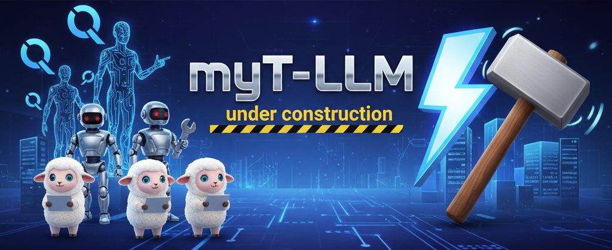

# 🐦‍🔥 myT-LLM
> myT-LLM (pronounced as _mighty-llm_)

author : Mahanth Yalla

Objective: Training a `Generative Pre-trained Transformer (GPT)` a.k.a. $\texttt{Decoder Only Transformer}$ from Scratch and compare with SOTA models online.

# Currently in development
 
> Ack: AI generated image - by the Gemini - [nanobanana.ai](https://nanobanana.ai/)


###  Overview
**myT-LLM** is a full-stack, from-scratch implementation of a **Generative Pre-trained Transformer (GPT)** model — built for research, reproducibility, and understanding.  
It's the continuation of the [miniGPT](https://github.com/Mahanth-Maha/mahaMiniGPT) project and represents a practical exploration of **modern SOTA (state-of-the-art)** architectural innovations.

This repository brings together:
- End-to-end LLM pretraining pipelines  
- Custom tokenization and data streaming  
- Experimental architecture variants (CerebrasGPT ,LLaMA, Qwen - inspired)  
- Efficient GPU-optimized training  

##  Objective
To build, train, and evaluate a GPT-style **decoder-only Transformer** from first principles — while integrating the **latest architectural and optimization techniques**.

**Core goals:**
- Understand each component's role in LLM design  
- Train scalable GPT variants (nano → small → base)  
- Compare SOTA enhancements like **SwiGLU**, **RMSNorm**, **GQA**, and **Flash Attention**  
- Benchmark loss curves, scaling laws, and stability  
- Open-source a clean research-grade training framework  

## Architecture Highlights

| Component | Choice / Implementation | Reference |
|------------|-------------------------|------------|
| **Model Type** | Decoder-only Transformer | QWEN / LLaMA lineage |
| **Normalization** | Pre-RMSNorm | [Zhang et al., 2019] |
| **Attention** | Multi-Head / Grouped-Query / Flash Attention | [Dao et al., 2022] |
| **Activation** | SwiGLU (2× FFN) | [Shazeer, 2020] |
| **Optimizer** | AdamW (with fused kernels) | |
| **Scheduler** | Cosine Decay + Warmup | [Chinchilla, 2022] |
| **Tokenizer** | Custom BPE / SentencePiece | |
| **Initialization** | GPT-2 style (std = 0.02) | [Radford et al., 2019] |


## Key Features
- Custom BPE Tokenizer (train your own)  
- End-to-End LLM Training Suite  
- Checkpointing, Resumption, and Logging  
- Flash Attention for faster context windows  
- RMSNorm + SwiGLU + GQA architecture  
- Cosine LR Scheduling + Warmup  
- ROCm/AMD GPU compatibility  
- Config-driven YAML setup for multi-model scaling  
- Built-in tests for dataset, trainer, and architecture  


## Repository Structure

```

myT-LLM/
├── Research/                 # Papers, notes, experiments
├── dev/                      # Tokenization & preprocessing
│   ├── 11_train_suite_v1/        # Baseline trainer
│   ├── 12_train_suite_v2/        # Improved dataset pipeline
│   ├── 13_train_suite_v3/        # Benchmarks & timing
│   ├── 16_Last_Min_Improvements/ # Stability & performance patches
│   ├── 17_The_End_Game/          # Finalized pipeline
│   └── 18_Lets_Train/            # Final training runs
├── stage/                    # Archived early stages
├── prod/                     # Production-ready LLM trainer
│   ├── architecture.py
│   ├── tokenizer.py
│   ├── trainer.py
│   ├── configs/
│   ├── cmds.prod.sh
│   └── main.py
└── assets/                   # Images

```

## Research Lineage
This project evolved from:

* [miniGPT](https://github.com/Mahanth-Maha/mahaMiniGPT) → theoretical and educational prototype
* **myT-LLM** — scaled-up, SOTA implementation with modern training infrastructure

### Influences:

* *Attention is All You Need* — Vaswani et al., 2017
* *Language Models are Few-Shot Learners* — OpenAI, 2020
* *FlashAttention* — Dao et al., 2022
* *Chinchilla Scaling Laws* — DeepMind, 2022
* *LLaMA: Open and Efficient Foundation Language Models* — Meta, 2023


## Motto

> “Don't just use Transformers — understand them.”
> — *myT-LLM Project*

